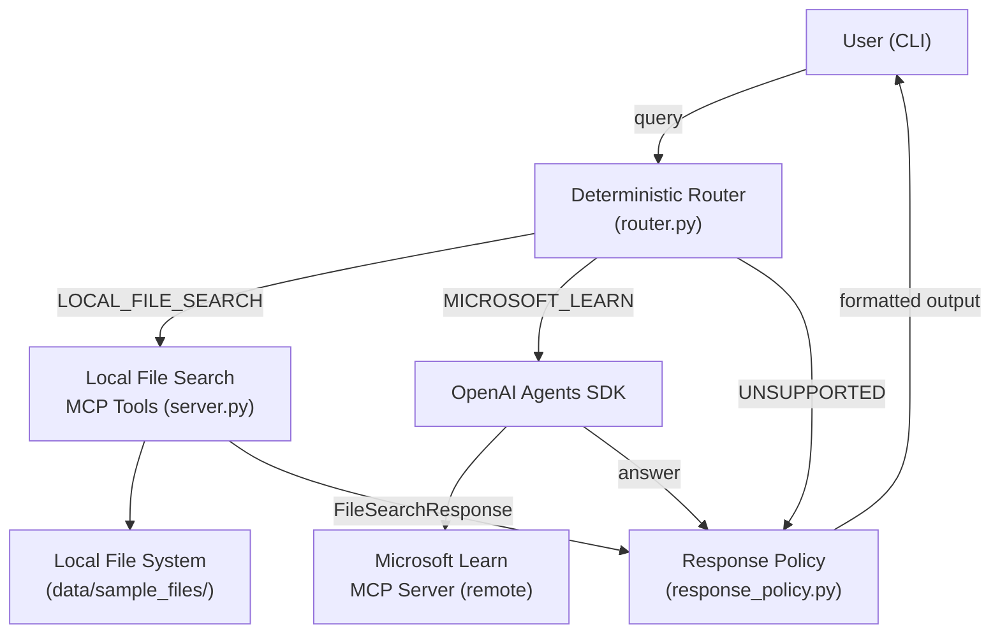

# MCP File Search Agent

A production-quality CLI agent that combines **local file metadata search** with **Microsoft Learn documentation queries** using the Model Context Protocol (MCP) and OpenAI GPT-4o.

---

## Architecture Overview



**Components:**

| Component | Description |
|---|---|
| `src/agent/router.py` | Deterministic keyword router – no LLM needed for routing |
| `src/agent/cli.py` | Interactive CLI loop with rich terminal output |
| `src/agent/config.py` | `pydantic-settings` configuration from `.env` |
| `src/agent/response_policy.py` | Enforce JSON-only / char-limit / refusal rules |
| `src/mcp_local_file_search/` | MCP server + search service + Pydantic models |

---

## Assignment Compliance Checklist

- [x] Local File Search MCP server (metadata-based)
- [x] Pydantic models for all structured I/O
- [x] Deterministic query router (pre-LLM)
- [x] OpenAI Agents SDK integration
- [x] Remote Microsoft Learn MCP integration
- [x] CLI interface
- [x] Natural-science sample data files
- [x] Unit tests (pytest)
- [x] Clean folder structure
- [x] README with setup and run instructions
- [x] Environment-based configuration
- [x] Logging (no secrets logged)
- [x] Error handling
- [x] No web UI

---

## Setup

### Prerequisites

- Python 3.11 or newer
- An OpenAI API key (only required for Microsoft/Azure queries)

### 1 – Clone and enter the project

```bash
git clone <repo-url>
cd mcp-file-search-agent
```

### 2 – Create a virtual environment

```bash
python -m venv .venv
# Windows
.venv\Scripts\activate
# macOS / Linux
source .venv/bin/activate
```

### 3 – Install the package and dependencies

```bash
pip install -e ".[dev]"
```

### 4 – Configure environment variables

```bash
cp .env.example .env
# Edit .env and set OPENAI_API_KEY (required for Azure/Microsoft queries)
```

### 5 – Generate sample data files

```bash
python scripts/create_sample_data.py
```

---

## Running the Agent

### Interactive CLI

```bash
python -m src.agent.main
```

or, after `pip install -e .`:

```bash
file-search-agent
```

### Standalone Local MCP Server

```bash
python -m src.mcp_local_file_search.server
```

or:

```bash
local-file-search-mcp
```

---

## Environment Variables

| Variable | Default | Description |
|---|---|---|
| `OPENAI_API_KEY` | _(none)_ | Required for Microsoft/Azure queries |
| `LOCAL_FILE_ROOT` | `./data/sample_files` | Root folder for local file search |
| `MICROSOFT_LEARN_MCP_URL` | `https://learn.microsoft.com/api/mcp` | Microsoft Learn MCP endpoint |
| `LOG_LEVEL` | `INFO` | Python logging level |
| `MODEL_NAME` | `gpt-4o` | OpenAI model for Microsoft queries |

---

## Sample Queries

### Local File Search (no API key needed)

```
> What PDF files are available in our system?
{
  "query_type": "local_file_search",
  "filters": { "extension": ".pdf", ... },
  "results": [ ... ],
  "result_count": 2,
  "errors": []
}

> Show files in the zoology folder
{...}

> List all txt files
{...}
```

### Microsoft / Azure (requires API key)

```
> What is Azure Blob Storage?
Azure Blob Storage is Microsoft's scalable object storage...

> Explain Microsoft Fabric Lakehouse
...
```

### Unsupported

```
> Who won the last football match?
Unsupported query. This agent only supports local file search and Microsoft/Azure documentation questions.
```

---

## Running Tests

```bash
pytest
pytest --cov=src --cov-report=term-missing
```

---

## Project Structure

```
mcp-file-search-agent/
├── README.md
├── pyproject.toml
├── .env.example
├── .gitignore
├── SKILLS.md
├── scripts/
│   └── create_sample_data.py
├── data/
│   └── sample_files/
│       ├── zoology/
│       ├── biology/
│       └── ecology/
├── docs/
│   ├── architecture.md
│   ├── usage_examples.md
│   ├── testing_strategy.md
│   └── quick_start.md
├── src/
│   ├── agent/
│   │   ├── config.py
│   │   ├── cli.py
│   │   ├── main.py
│   │   ├── prompts.py
│   │   ├── router.py
│   │   └── response_policy.py
│   └── mcp_local_file_search/
│       ├── models.py
│       ├── utils.py
│       ├── search.py
│       └── server.py
└── tests/
    ├── conftest.py
    ├── test_models.py
    ├── test_file_search.py
    ├── test_router.py
    └── test_response_policy.py
```

---

## GitHub Submission

1. Ensure `.env` is **not** committed (`.gitignore` excludes it).
2. Verify `.env.example` is committed.
3. Run `pytest` – all tests must pass.
4. Push to your repository.

---

## Known Limitations

- Date-based filter parsing from natural language is not implemented (good-version scope).
- The `LOCAL_FILE_ROOT` must contain files with supported extensions (`.pdf`, `.docx`, `.xlsx`, `.xls`, `.jpg`, `.jpeg`, `.txt`).
- Microsoft Learn MCP queries require a valid OpenAI API key and internet connectivity.

## Future Extension Points

- PDF text extraction with `pypdf` for full-text search
- SQLite metadata index for large file trees
- Semantic search with embeddings
- Docker packaging / GitHub Actions CI
- Web UI frontend
